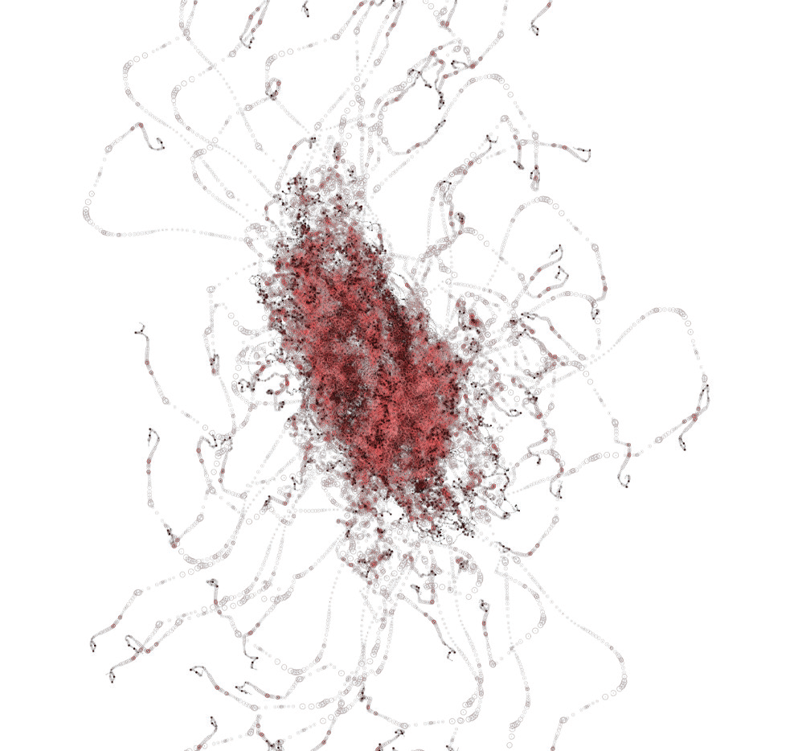
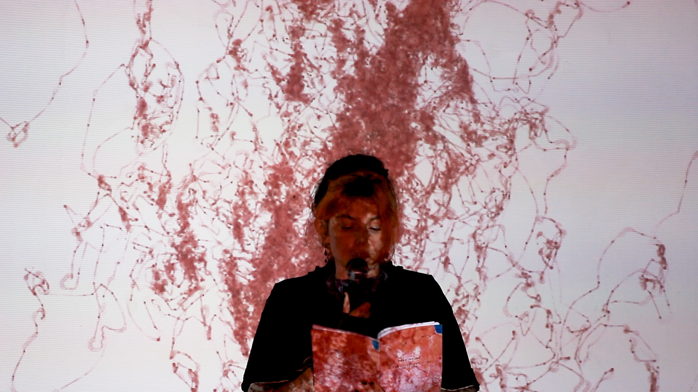

# hapticKiss

# INTORDUCTION
hapticKiss was born from my growing interest in poetry and words - the importance of storytelling. Over the past
years I have been writing in tandem with my digital arts practice, and wanted to explore bridging the two in an
organic and elegant way - allowing the words to be a part of the work rather than something that accompanies it. I
started thinking about the duration of a poem, what the reader experiences in that space, and how, if at all, this is
changed depending on who is reading.

# CONCEPT & BACKGROUND RESEARCH
The concept is a performer reciting a poem in front of a screen or projection, the sound of their voice drives an
organically forming image that is drawn over the duration of the poem. The algorithm for the drawing is altered
both by the pitch and volume of the reader’s voice which will affect the direction, opacity and stroke weight of the
drawing.

# EQUIPMENT
* Computer with VS Code installed and loaded
* Performer
* Microphone - tested using: Microphone Shure SM58 - 36425
* Soundcard/audio interface - tested using: Behringer UMC204HD - 36365
* Stereo speaker
* HDMI cable

# INSTALLATION & DISPLAY
An installation performance with projector and performer. The projection must be landscape and in 16:9 format - unless larger immersive space is available - and the size can vary depending on available space. Minimum of 250cm wide. The performer must stand in the exact center of the projection width, and the height should be mapped so that the starting visuals align with the space between the performer's eyebrows. 

The performer should be a minimum of three metres from the audience.

Set up the microphone into the audio interface, test it is working by running the code and ensuring there is mic level in the console. Connect the computer into the projector using the HDMI cable.

To start the visuals, load the unzipped folder into VS Code, ensure the Live Server addon is installed, navigate into the sketch.js file and click 'Go Live' at the bottom right of the VS Code window.

When ready for the performance to start, press the 'f' key triggerinf the full screen mode and the mic to start functioning.

# COMPUTER
The computer must be able to run VisualStudio Code. 

# SPACE & SOUND
The space should be as sound proofed as much as possible and the audience must be told to remain as quiet as possible, especially at the start of the performance so that it does not trigger too early. 

The mic input volume settings can be altered in order to reduce background sound triggering it under the update() function in the mold class:

 if (vol > 0.01) {
      stepSize = map(vol, 0.01, 0.2, 0.5, 7);
    } else {
      stepSize = 0;
    }

test the space before by increasing the volume in the if statement in increments of 0.1 to see if background noise is triggering the visuals.

**PLEASE NOTE** that raising it above 0.6 will change the affect of the performance and should be avoided

# LIGHT
Performance is most effective in a dark space. Please turn off all lights - apart from emergency ones - for the duration of the performance

# IMAGES
Screenshots:
This should be the waiting screen

Wait until performer is ready and lights are out, then press the 'f' key to trigger the start of the performance.

If the visuals start like this before the performer starts speaking, raise the input volume level in the if statament as shown in *SPACE & SOUND*. Test and repeat until background noise no longer triggers the visuals.

If all is correct, the performance should look like this.

